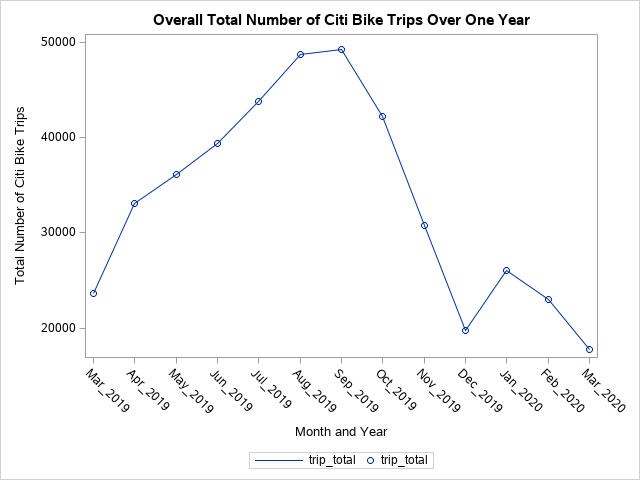
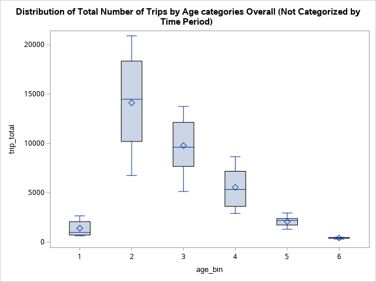
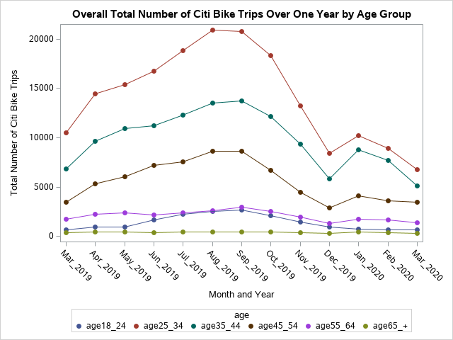
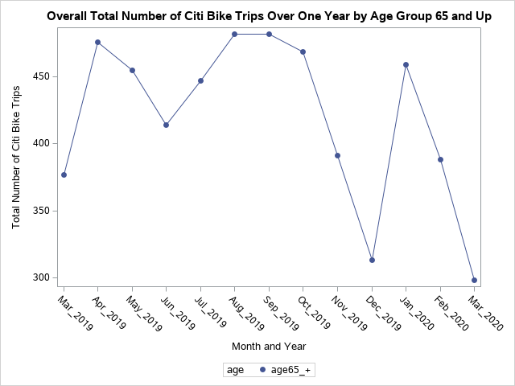

# SAS Analysis of the Citi Bike Data from March 2019 - March 2020

## General Discussion

### Citi Bike data is collected, organized and made public here: [Citi Bike Data](https://www.citibikenyc.com/system-data)

#### Using the Citi Bike data sets from March 2019 through March 2020, trend analysis was conducted in order to identify if there was a notable drop or increase in Citi Bike trips due to epidemiological impact. Given the risk factors among older adults (65 and older), it would be of importance to identify trends stratified by age categories. Using SAS (code provided in Jupyter Notebook), analysis was conducted to clean and manipulate the data to provide a simple trend analysis, but to also prepare the data for further analysis using Tableau. The associated Tableau dashboard using the Citi Bike March 2020 data may be found here: (https://public.tableau.com/profile/kristi.bischoff#!/vizhome/CitiBikeMarch2020DemographicsSubscriberStatusandMapping/CitiBikeMarch2020Story). 

#### **Multiple plots were developed to illustrate the trends and basic statistical and exploratory analysis of the data by customer demographics. Please refer to the plots below.

#### Overall, there was a decline in Citi Bike Trips in March 2020 comapred to March 2019. In general, the winter months show less bike trips, and one can infer that this has to do with inclimate weather and/or very cold temperatures that would be uncomfortable for the casual bicyclist. March is usually not improving in temperature along the East Coast, so there may not be an increase in bike trips until April or later (according to the plots.) The majority of bike trips are within the age 25-34 population, which shows the greateast range of the number of bike trips (in the distribution analysis.) The age 65 and older population accounts for the least number of bike trips across all months in the analysis. However, when subsetting the data, each age bin does show a consistent decline in the number of bike trips by March 2020 compared to March 2019. 

#### In order to forecast future use of the Citi Bike program, it would be essential to use simple trend analysis such as what is provided in this repository in order to direct future analysis. Due to other factors such as weather, it would be advantageous to look at data over multiple years in order to identify and control for these other factors when looking at trends. Future work includes developing statistical analysis on what is significantly impacting the change in Citi Bike use over time. 

## Plots:

## Overall total number of Citi Bike trips:

## Age distributions with boxplots

## Number of Citi Bike trips by age categories:

## Subset 2019 to 2020 Total Citi Bike trips by age 65+:

